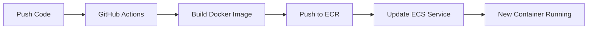

# CI/CD - GitHub Actions AWS Deployment

This document explains how the automated deployment works when you push backend changes to the `main` branch and they are deployed in `preprod` environment.

## How It Works

When you push code that changes `webapp/backend/**`, GitHub Actions automatically:

1. **Builds** your backend into a Docker container
2. **Pushes** it to AWS ECR (container registry)
3. **Restarts** the ECS service to use the new container

The process takes about 3-5 minutes and requires no manual intervention.

## What Triggers a Deployment

The workflow runs when:

- You push to the `main` branch AND some files have been changed by this push in `webapp/backend/` directory
- You manually trigger it via "Actions" tab on GitHub

## Required AWS Resources

The deployment needs these AWS resources to work (managed by Terraform):

### Core Infrastructure

- **ECR Repository**: `vanity-market-preprod-backend` - stores Docker images
- **ECS Cluster**: `vanity-market-preprod-main` - runs containers
- **ECS Service**: `backend` - manages the running backend containers

### Security & Permissions

- **GitHub OIDC Provider**: Allows GitHub to authenticate with AWS
- **IAM Role**: `vanity-market-preprod-github-actions-backend-deploy`
- **IAM Policies**: ECR push/pull permissions, ECS update permissions

### GitHub Secrets Required

- `AWS_ROLE_TO_ASSUME`: The IAM role ARN for GitHub Actions

## Deployment Flow

## Container Tagging Strategy

Images are tagged with:

- `main`, `<git-sha>` - specific commit
- `latest` - most recent build

## Monitoring Your Deployment

1. **GitHub Actions**: Check the "Actions" tab for build status
2. **AWS ECS**: Service will show "PENDING" then "RUNNING"
3. **Application**: Test your API endpoints after deployment completes

## Troubleshooting

Remember to read the logs first.

### Build Fails

- Check Dockerfile syntax in `webapp/backend/Dockerfile`
- Verify all dependencies are properly defined

### AWS Authentication Fails

- Ensure all the GitHub secrets (note that they might be scoped to an environment!) are correctly set
- Verify IAM role exists and has proper trust relationship

### ECS Update Fails

- Check if ECS cluster and service exist
- Verify IAM role has ECS update permissions

### Container Won't Start

- Check ECS service events in AWS Console
- Review CloudWatch logs for the backend service
