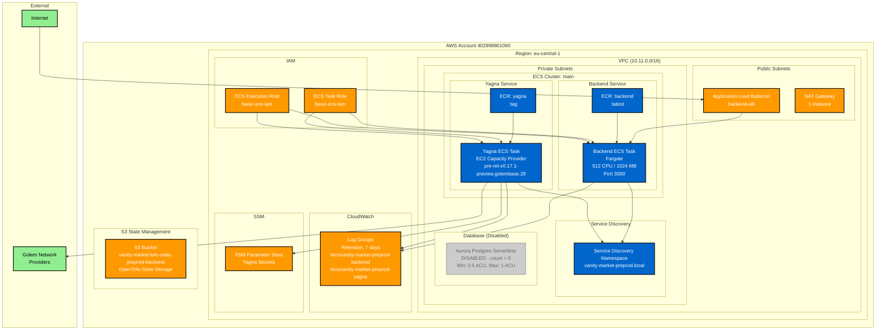

# Backend Infrastructure Architecture - vanity.market Preprod

## Architecture Overview

**Environment**: vanity-market-preprod  
**Region**: eu-central-1  
**VPC CIDR**: 10.11.0.0/16

### Core Components

1. **VPC & Networking**
   - Public subnets: ALB, NAT Gateway (1 instance)
   - Private subnets: ECS services, service discovery
   - Internet connectivity via NAT Gateway

2. **Container Services (ECS)**
   - **Backend**: Fargate task (512 CPU, 1024 MB) on port 3000
   - **Yagna**: EC2 capacity provider for Golem network integration
   - **Service Discovery**: Internal DNS resolution

3. **Container Registries (ECR)**
   - Backend: `:latest` tag
   - Yagna: `pre-rel-v0.17.1-preview.golembase.28` tag

4. **Load Balancing**
   - Application Load Balancer in public subnets
   - Routes traffic to backend ECS service

5. **Database**
   - Aurora Postgres Serverless (currently disabled)
   - Would provide 0.5-1 ACU capacity when enabled

6. **Monitoring & Secrets**
   - CloudWatch logs (7-day retention)
   - SSM Parameter Store for secrets
   - IAM roles for task and execution permissions

### Key Features

- **Scalability**: ECS with desired count 1 (configurable)
- **Security**: Private subnets, IAM roles, security groups
- **Monitoring**: Centralized logging to CloudWatch
- **State Management**: OpenTofu state in dedicated S3 bucket
- **Service Communication**: Internal service discovery for Yagna ↔ Backend
- **External Integration**: Yagna connects to Golem network providers

### Current Limitations

- Database is disabled (count = 0)
- Single NAT Gateway (not highly available)
- No SSL certificate on ALB
- Fixed desired count (no auto-scaling)